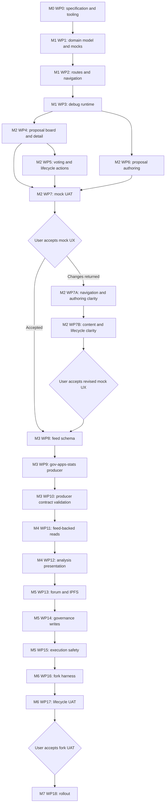

# DAO Governance Dependency Graph

```mermaid
flowchart TD
  WP0["M0 WP0: specification and tooling"] --> WP1["M1 WP1: domain model and mocks"]
  WP1 --> WP2["M1 WP2: routes and navigation"]
  WP2 --> WP3["M1 WP3: debug runtime"]
  WP3 --> WP4["M2 WP4: proposal board and detail"]
  WP3 --> WP6["M2 WP6: proposal authoring"]
  WP4 --> WP5["M2 WP5: voting and lifecycle actions"]
  WP4 --> WP7["M2 WP7: mock UAT"]
  WP5 --> WP7
  WP6 --> WP7
  WP7 --> GateM2Initial{"User accepts mock UX"}
  GateM2Initial -->|"Changes returned"| WP7A["M2 WP7A: navigation and authoring clarity"]
  WP7A --> WP7B["M2 WP7B: content and lifecycle clarity"]
  WP7B --> GateM2{"User accepts revised mock UX"}
  GateM2Initial -->|"Accepted"| WP8["M3 WP8: feed schema"]
  GateM2 --> WP8
  WP8 --> WP9["M3 WP9: gov-apps-stats producer"]
  WP9 --> WP10["M3 WP10: producer contract validation"]
  WP10 --> WP11["M4 WP11: feed-backed reads"]
  WP11 --> WP12["M4 WP12: analysis presentation"]
  WP12 --> WP13["M5 WP13: forum and IPFS"]
  WP13 --> WP14["M5 WP14: governance writes"]
  WP14 --> WP15["M5 WP15: execution safety"]
  WP15 --> WP16["M6 WP16: fork harness"]
  WP16 --> WP17["M6 WP17: lifecycle UAT"]
  WP17 --> GateM6{"User accepts fork UAT"}
  GateM6 --> WP18["M7 WP18: rollout"]
```

WP9 belongs to `gov-apps-stats`. All other packages belong to
`governance-apps`. Cross-repository work does not share branches or integration
worktrees.
