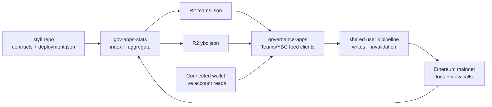

# Teams + YBC Production Plan

Status: active production plan
Date: 2026-06-30
Last updated: 2026-07-29
Primary repos: `governance-apps`, `gov-apps-stats`, `styfi`

## 1. Current decision

The Teams and YBC apps should now move from mock-backed prototype mode to a
feed-backed production path.

The frontend consumer, read, and write work is ready for preprod. The current Teams v1
feed is unsafe for finance, so Teams finance fails closed while nonfinancial data stays
available. Publishing and validating the corrected Teams v2 object is still
outstanding. YBC remains on feed version 1.

The remaining production path is:

1. publish and validate a corrected Teams v2 candidate;
2. smoke test launch writes on a mainnet fork using live or saved feed JSON;
3. smoke test route, wallet, feed, and host behavior on preprod/beta;
4. hot-switch the stable Teams object to v2, then enable approved production flags;
5. monitor feed freshness and early write reports.

No per-app mock/live split or separate write-only feature flag is planned for this
controlled launch. `NEXT_PUBLIC_USE_MOCKS` remains a global local/debug toggle. In
production, `NEXT_PUBLIC_ENABLE_TEAMS` and `NEXT_PUBLIC_ENABLE_YBC` expose each whole
app after its read and launch-write checks pass.

## 2. Ownership model

Use a hybrid cross-repo model:

- `governance-apps` owns the consumer contract, schema docs, UI assumptions, frontend
  validation, writes, fork smoke, and production rollout docs.
- `gov-apps-stats` owns chain/event indexing, feed generation, cursor state, R2 writes,
  and producer tests.
- `styfi` remains the source of truth for deployed addresses and contract behavior.

The consumer contract must be written before the producer implementation starts. This
keeps the external data producer from optimizing for whatever is easiest to emit while
the frontend needs a different shape.

## 3. Architecture

Historical lists, proposal boards, team rosters, approvals, bonuses, and derived
financial state belong in `gov-apps-stats`. Browser code should not scan historical logs.

Wallet-specific eligibility and write readiness belong in the frontend because they are
small, current-state decisions tied to the connected account, current chain, balances,
allowances, and simulation. Producer fields such as Teams `team.availableActions` may be
kept as compatibility hints, but production write CTAs must not treat them as
authoritative permissions.

Operational switches are intentionally simple:

- `NEXT_PUBLIC_USE_MOCKS=true` is global and for local/debug or deterministic E2E use
  only; it is not allowed in production.
- There are no per-app mock/live switches for Teams or YBC.
- Production app flags expose the complete app surface. For this launch that means
  feed-backed reads plus launch-scope writes together, not a separate read-only or
  write-only production mode.
- State-specific UI coverage for Teams/YBC should use fixtures or test-time interception
  of `/api/teams-data` and `/api/ybc-data`, not production mock mode.

## 4. Production scope

### Teams launch scope

Read scope:

- team directory and selected team workspace;
- active, retired, and migrated team lifecycle state;
- current and historical budget periods;
- revenue, costs, profit/loss, and lifetime totals;
- revenue deposit history;
- funding approvals, claimable amounts, claims, vesting, returns, and refund totals;
- bonus periods, parameters, pending claim cursor, estimated claimable YFI, YBC split,
  and claim history;
- accepted revenue/funding tokens and oracle/converter metadata.

Write scope:

- deposit revenue through `Team.deposit_revenue`;
- claim funding through `Team.claim_funding`;
- return funding through `Team.return_funding`;
- claim team bonus through `BonusDistributor.claim`.

Explicitly out of launch scope:

- generic admin setter UI;
- vest claim management after funding claim;
- generic contract interaction tools.

### YBC launch scope

Read scope:

- member roster and membership history;
- raw upstream stake and effective YBC weight;
- proposal lifecycle, votes, thresholds, execution status, and timing;
- reward distributor summary and claim history;
- operator/config visibility needed to explain current state.

Write scope:

- propose addition;
- propose expulsion;
- retract own proposal;
- vote yea;
- vote nay;
- execute passed proposal.

Explicitly out of launch scope:

- arbitrary-call operator console;
- duplicate staking UX;
- separate isolated YBC reward claim engine.

YBC rewards should continue to hand off to the shared reward claim path unless a later
product decision explicitly changes that.

## 5. Required feeds

The producer publishes two standalone feed objects:

- one stable `teams.json` v2 object, documented in
  `docs/apps/teams/onchain-integration-plan/teams-feed-schema-v1.md`;
- `ybc.json`, documented in
  `docs/apps/ybc/onchain-integration-plan/ybc-feed-schema-v1.md`.

Do not merge these into the existing shared `stats.json`. The payloads are app-specific
and independently versioned. Teams does not use parallel v1/v2 endpoints:
`NEXT_PUBLIC_TEAMS_DATA_URL` stays fixed while its object is replaced atomically.

Recommended frontend env keys:

- `NEXT_PUBLIC_TEAMS_DATA_URL`;
- `NEXT_PUBLIC_YBC_DATA_URL`.

Recommended producer internals:

- persistent scan state per feed;
- conservative confirmation depth before publishing logs;
- atomic R2 object writes;
- retained corrected v2 objects for investigation and tested rollback.

Do not add producer complexity for wallet-specific Teams action eligibility. Emit the
raw facts needed by the UI, such as team status, ownership, current period, claimable
funding, bonus status, token metadata, and revenue-recipient state.
`team.availableActions` remains a compatibility hint, not the consumer authority for
writes.

## 6. Release sequence

1. Generate and validate the exact Teams v2 candidate against the producer contract.
2. Deploy the compatible frontend to preprod while v1 finance remains unavailable.
3. Run the UAT checklist and fork smoke against the candidate.
4. Deploy the approved frontend, then atomically replace the object at the stable Teams
   URL with v2.
5. Purge the producer cache or wait the full 60-second cache window.
6. Verify canonical acceptance, financial values, actions, and feed freshness.
7. Release YBC independently behind its production flag after its checks pass.

## 7. Validation gates

Before production:

- schema validation for `teams.json` and `ybc.json`;
- producer tests for log reducers and view-call aggregation;
- frontend adapter tests for feed parsing and safe fallbacks;
- Teams unit tests for period math, funding claimability, and bonus display state;
- Teams write tests for client-derived CTA eligibility, including a guard that
  `team.availableActions` is not trusted as authorization;
- YBC unit tests for epoch math, proposal status, threshold display, and action
  eligibility;
- targeted fork smoke for the launch write paths;
- fixture or route-intercept coverage for Teams/YBC states absent from live feeds;
- preprod smoke on shared route and beta host;
- wrong-network and missing-feed fallback checks.

Use the repeatable
[`fork-smoke plan`](teams-ybc-fork-smoke-plan.md) and
[`preprod UAT checklist`](teams-ybc-feedback-uat.md). Live or saved feed JSON covers the
normal path. Fixtures or route interception may cover states absent from the live feed.
Repeat fork smoke whenever onchain clients, write hooks, transaction plumbing, approval
handling, amount parsing, action gating, wallet or chain handling, or write arguments
change. UX-only changes can use mock and component tests.

## 8. Rollback

- publish a fresh corrected and validated Teams v2 object;
- roll back a tested frontend/feed pair;
- disable the affected app production flag;
- revert the route mapping if host-level exposure causes issues.

Never roll Teams back to the unsafe v1 accounting object. If no compatible frontend
and corrected v2 pair is ready, disable Teams instead.

## 9. Open inputs

- final R2 staging and production URLs;
- confirmation depth and reorg policy for feed publication;
- cursor-state storage path in `gov-apps-stats`;
- operator/member/team-owner wallets to use for fork smoke;
- whether launch should expose Teams and YBC together or independently.

Deployment block heights are already available in `styfi/deployment.json`:
`STYFI_DEPLOY_BLOCK=24377403`, `YBC_DEPLOY_BLOCK=25228044`, and
`TEAMS_DEPLOY_BLOCK=25244861`.
