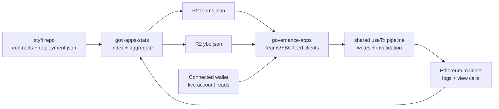

# Teams + YBC Production Plan

Status: active production plan
Date: 2026-06-30
Primary repos: `governance-apps`, `gov-apps-stats`, `styfi`

## 1. Current decision

The Teams and YBC apps should now move from mock-backed prototype mode to a
feed-backed production path.

The old blocking assumption was that the contract deployment manifest still needed to be
assembled. That is no longer true. `../styfi` `master` now contains the deployment
manifest and finalized contract sources needed to define the app data contracts.

The remaining production path is:

1. define the consumer feed contracts in `governance-apps`;
2. implement `teams.json` and `ybc.json` in `gov-apps-stats`;
3. validate staging feeds from the frontend consumer side;
4. wire feed-backed reads in `governance-apps`;
5. wire the limited write surface through the shared transaction pipeline;
6. smoke test on a mainnet fork and preprod host;
7. enable production flags in a controlled release.

## 2. Ownership model

Use a hybrid cross-repo model:

- `governance-apps` owns the consumer contract, schema docs, UI assumptions, frontend
  validation, writes, fork smoke, and production rollout docs.
- `gov-apps-stats` owns chain/event indexing, feed generation, cursor state, R2 writes,
  and producer tests.
- `styfi` remains the source of truth for deployed addresses and contract behavior.

The consumer contract must be written before the producer implementation starts. This
keeps the external data producer from optimizing for whatever is easiest to emit while
the frontend needs a different shape.

## 3. Architecture

Historical lists, proposal boards, team rosters, approvals, bonuses, and derived
financial state belong in `gov-apps-stats`. Browser code should not scan historical logs.

Wallet-specific eligibility and write readiness may still use live chain reads in the
frontend because those are small, current-state calls tied to the connected account.

## 4. Production scope

### Teams launch scope

Read scope:

- team directory and selected team workspace;
- active, retired, and migrated team lifecycle state;
- current and historical budget periods;
- revenue, costs, profit/loss, and lifetime totals;
- revenue deposit history;
- funding approvals, claimable amounts, claims, vesting, returns, and refund totals;
- bonus periods, parameters, pending claim cursor, estimated claimable YFI, YBC split,
  and claim history;
- accepted revenue/funding tokens and oracle/converter metadata.

Write scope:

- deposit revenue through `Team.deposit_revenue`;
- claim funding through `Team.claim_funding`;
- return funding through `Team.return_funding`;
- claim team bonus through `BonusDistributor.claim`.

Explicitly out of launch scope:

- generic admin setter UI;
- vest claim management after funding claim;
- generic contract interaction tools.

### YBC launch scope

Read scope:

- member roster and membership history;
- raw upstream stake and effective YBC weight;
- proposal lifecycle, votes, thresholds, execution status, and timing;
- reward distributor summary and claim history;
- operator/config visibility needed to explain current state.

Write scope:

- propose addition;
- propose expulsion;
- retract own proposal;
- vote yea;
- vote nay;
- execute passed proposal.

Explicitly out of launch scope:

- arbitrary-call operator console;
- duplicate staking UX;
- separate isolated YBC reward claim engine.

YBC rewards should continue to hand off to the shared reward claim path unless a later
product decision explicitly changes that.

## 5. Required feeds

The producer must publish two standalone feed objects:

- `teams.json`, documented in
  `docs/apps/teams/onchain-integration-plan/teams-feed-schema-v1.md`;
- `ybc.json`, documented in
  `docs/apps/ybc/onchain-integration-plan/ybc-feed-schema-v1.md`.

Do not merge these into the existing shared `stats.json`. The payloads are app-specific,
more complex, and should be independently versioned and rolled back.

Recommended frontend env keys:

- `NEXT_PUBLIC_TEAMS_DATA_URL`;
- `NEXT_PUBLIC_YBC_DATA_URL`.

Recommended producer internals:

- persistent scan state per feed;
- conservative confirmation depth before publishing logs;
- atomic R2 object writes;
- previous-good-object retention for rollback.

## 6. Work packages from here to production

### Shared and cross-repo packages

| Package | Repo | Owner role | Purpose |
| --- | --- | --- | --- |
| Shared WP1 | `governance-apps` | Consumer planner | Define Teams/YBC feed contracts and production plan. |
| Shared WP2 | `gov-apps-stats` | Producer implementer | Implement event/view indexing and publish staging feeds. |
| Shared WP3 | `governance-apps` | Consumer verifier | Validate staging feed shape, freshness, and semantic fit. |

### Teams packages

| Package | Repo | Purpose |
| --- | --- | --- |
| Teams WP9 | `governance-apps` | Replace mock-only reads with `teams.json` feed-backed reads and live wallet overlays. |
| Teams WP10 | `governance-apps` | Wire launch-scope Teams writes through shared `useTx`. |
| Teams WP11 | `governance-apps` | Run fork/preprod smoke, UAT, release notes, and rollback checks. |

### YBC packages

| Package | Repo | Purpose |
| --- | --- | --- |
| YBC WP8 | `governance-apps` | Replace mock-only reads with `ybc.json` feed-backed reads and live wallet overlays. |
| YBC WP9 | `governance-apps` | Wire launch-scope YBC writes through shared `useTx`. |
| YBC WP10 | `governance-apps` | Run fork/preprod smoke, UAT, release notes, and rollback checks. |

## 7. Recommended sequencing

1. Land Shared WP1 in `agent/data`.
2. Start a `gov-apps-stats` Codex thread/worktree with the Shared WP2 handoff brief.
3. Publish staging `teams.json` and `ybc.json`.
4. Validate staging payloads from `governance-apps` as Shared WP3.
5. Run Teams WP9 and YBC WP8 in parallel once feed shape is accepted.
6. Run Teams WP10 and YBC WP9 in parallel once reads are stable.
7. Run Teams WP11 and YBC WP10 after writes are available.
8. Merge accepted packages through `agent/integration`.
9. Release behind production flags per app, not as one all-or-nothing switch.

If only one implementer is available, do the producer work first, then Teams reads, then
YBC reads, then writes. Teams has the higher data-model risk; YBC has the cleaner write
surface once the proposal feed is correct.

## 8. Sub-agent usage

Use the same implementer/reviewer/integrator split already used in this repo.

Recommended agents:

- **consumer planner** in `governance-apps.agent.data`: owns docs, schemas, and handoff.
- **producer implementer** in `gov-apps-stats`: implements Shared WP2 only.
- **producer reviewer** in `gov-apps-stats`: reviews indexing correctness, cursor safety,
  schema compliance, and tests.
- **consumer verifier** in `governance-apps`: validates real staging feeds against schema
  and frontend needs before app wiring starts.
- **frontend implementers** in Teams/YBC work package worktrees: implement one app package
  each.
- **frontend reviewers**: review package scope, route behavior, state coverage, tests, and
  docs.
- **integrator** in `agent/integration`: merges accepted packages and records release notes.

Do not let two agents independently invent producer and consumer shapes. The feed contract
is the dependency between repos.

## 9. Validation approach

Minimum validation before production:

- schema validation for `teams.json` and `ybc.json`;
- producer tests for log reducers and view-call aggregation;
- frontend adapter tests for feed parsing and safe fallbacks;
- Teams unit tests for period math, funding claimability, and bonus display state;
- YBC unit tests for epoch math, proposal status, threshold display, and action
  eligibility;
- targeted fork smoke for the launch write paths;
- preprod smoke on shared route and beta host;
- wrong-network and missing-feed fallback checks.

Do not require exhaustive mock-state replay before launch. Keep the old mock states for
debug and regression coverage, but do not block production on every historical visual state.

## 10. Rollout gates

Production exposure requires:

- staging feeds valid and fresh;
- frontend reads no longer depend on mock-only backends in production mode;
- launch-scope writes simulate before submit and use shared `useTx`;
- fork smoke evidence captured;
- preprod host smoke green;
- production feature flags documented;
- rollback path tested.

Rollback options:

- disable the app production flag;
- point env back to previous-good R2 object;
- hide write CTAs while keeping read-only route available;
- revert the route mapping if host-level exposure causes issues.

## 11. Open inputs

These must be resolved during Shared WP2 or Shared WP3:

- final R2 staging and production URLs;
- confirmation depth and reorg policy for feed publication;
- cursor-state storage path in `gov-apps-stats`;
- operator/member/team-owner wallets to use for fork smoke;
- whether launch should expose Teams and YBC together or independently.

Deployment block heights are already available in `styfi/deployment.json`:
`STYFI_DEPLOY_BLOCK=24377403`, `YBC_DEPLOY_BLOCK=25228044`, and
`TEAMS_DEPLOY_BLOCK=25244861`.
